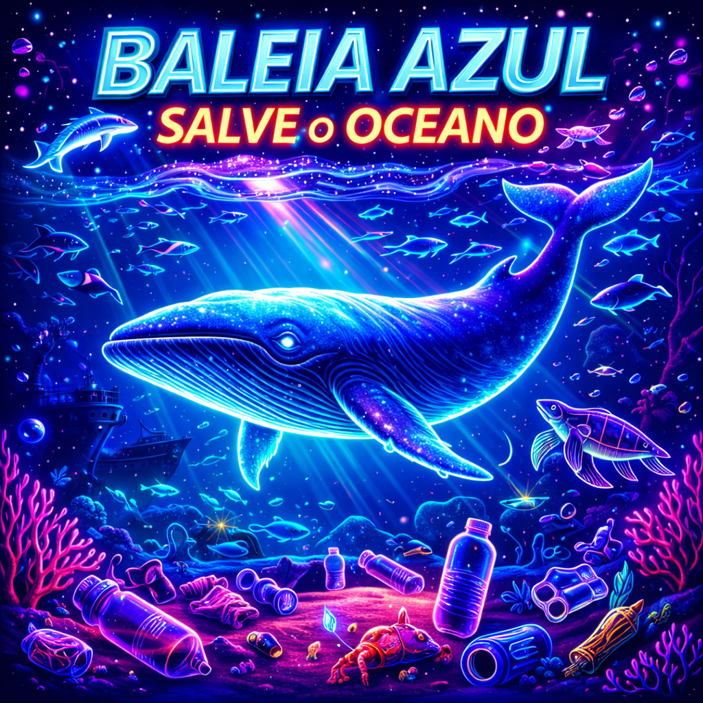

# Baleia Azul - Salve o Oceano



Bem-vindo ao **Baleia Azul - Salve o Oceano**, um emocionante jogo de navegabilidade e marinha feito em Lua com Love2D. Controle uma majestosa baleia azul em sua jornada através dos oceanos, evitando obstáculos perigosos e defendendo-se para alcançar a pontuação mais alta!

## 🎮 Como Jogar

### Objetivo
- **Sobreviva** o máximo possível desviando de obstáculos marinhos perigosos
- **Atire bolhas** para destruir obstáculos e ganhar pontos
- **Alcance uma pontuação alta** para entrar no Top 10 do ranking mundial
- **Proteja os oceanos** representados por diferentes ambientes aquáticos

### Controles
- **W/↑, A/←, S/↓, D/→**: Movimentam a baleia azul
- **ESPAÇO**: Dispara bolhas de ar para destruir obstáculos
- **ENTER**: Confirmar ações (inserir nome, reiniciar)
- **ESC**: Sair do jogo

### Sistema de Pontuação
- Cada obstáculo destruído concede pontos (10-30 pontos dependendo do tipo)
- Pontuação infinita - quanto mais tempo sobreviver, mais pontos acumula
- Dificuldade progressiva - o jogo fica mais difícil conforme sua pontuação aumenta
- Sistema de ranking persistente - suas melhores pontuações são salvas automaticamente

### Ranking
- **Top 10 jogadores** com as maiores pontuações
- **Sistema de medalhas** 🥇🥈🥉 para os 3 primeiros colocados
- **Digite seu nome** quando perder para registrar sua pontuação
- Ranking salvo localmente - suas conquistas permanecem entre sessões

## 🛠️ Requisitos do Sistema
- **Love2D 11.0+** (disponível em [love2d.org](https://love2d.org))
- **Windows, macOS ou Linux** com suporte a OpenGL

## 🚀 Instalação e Execução

### Método 1: Execução Direta (Windows)
1. **Baixe o Love2D** do site oficial
2. **Extraia os arquivos do jogo** em uma pasta
3. **Arraste a pasta do jogo** sobre o executável do Love2D
4. **Ou** execute via linha de comando:
   ```
   love caminho/para/a/pasta/do/jogo
   ```

### Método 2: Pacote Executável
1. **Crie um arquivo .love** (opcional):
   ```
   zip -9 -r baleia_azul.love . -x "*.git*"
   ```
2. **Execute** com Love2D:
   ```
   love baleia_azul.love
   ```

### Estrutura de Arquivos
```
baleia_azul/
├── main.lua          # Arquivo principal do jogo
├── img/              # Sprites e imagens do jogo
│   ├── baleia.png
│   ├── background.png
│   ├── meteoro.png
│   ├── tiro.png
│   └── explosao_nave.png
├── audios/           # Efeitos sonoros e música
│   ├── ambiente.wav
│   ├── destruicao.wav
│   ├── game_over.wav
│   └── disparo.wav
└── ranking.dat       # Arquivo de ranking (gerado automaticamente)
```

## 🎯 Dicas e Estratégias
1. **Mantenha-se em movimento** - obstáculos aparecem de todos os lados
2. **Use tiros estratégicos** - alguns obstáculos valem mais pontos
3. **Fique nas bordas** para ter mais tempo de reação
4. **Observe os padrões** - obstáculos têm comportamentos diferentes
5. **Gerencie seu espaço** - não fique sem área para manobrar

## 🔧 Personalização
O jogo permite fácil personalização modificando as constantes no início do arquivo `main.lua`:
- `LARGURA_TELA` e `ALTURA_TELA`: Dimensões da tela
- `MAX_OBSTACULOS`: Número máximo de obstáculos simultâneos
- Velocidades e comportamentos dos obstáculos
- Pontuações por tipo de obstáculo

## 🤝 Contribuição
Contribuições são bem-vindas! Se você deseja:
- **Reportar bugs**: Abra uma issue descrevendo o problema
- **Sugerir melhorias**: Compartilhe suas ideias
- **Adicionar recursos**: Envie um pull request

### Áreas para Melhoria
- Novos tipos de obstáculos marinhos
- Power-ups e habilidades especiais
- Fases temáticas diferentes
- Multiplayer cooperativo
- Gráficos e animações aprimoradas

## 👨‍💻 Créditos
**Desenvolvido por** RaphaelTW com adaptação do jogo original "14bis vs Meteoros"

**Baseado no projeto original de**:
- [RaphaelTW](https://github.com/RaphaelTW)
- [MatheusDAGL](https://github.com/MatheusDAGL)

**Recursos utilizados**:
- Love2D Framework
- Lua Programming Language
- Arte e sons originais adaptados

## 🌊 Sobre o Tema Marinho
O jogo promove conscientização sobre a vida marinha:
- **Baleia Azul**: Maior animal do planeta, em risco de extinção
- **Preservação dos Oceanos**: Ambiente que precisa de proteção
- **Educação Ambiental**: Divertimento com mensagem ecológica

## 📜 Licença
Este projeto é licenciado sob a **Licença MIT** - veja o arquivo [LICENSE](LICENSE) para detalhes.

## 📞 Suporte
Encontrou problemas ou tem dúvidas?
1. Verifique se o Love2D está instalado corretamente
2. Confira se todos os arquivos estão nas pastas corretas
3. Consulte as issues no GitHub para soluções conhecidas
4. Entre em contato através das issues do repositório

---

**Divirta-se explorando os oceanos e protegendo a baleia azul! Quebre recordes, entre no ranking e torne-se um verdadeiro protetor dos mares!** 🐋💙